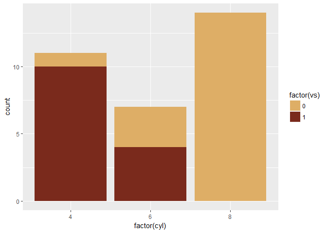

# sfPalettes - Sci-fi movie colour palettes
Anthony Caravaggi  


# sfPalettes

sfPalettes is a library of colour palettes based on popular (and, perhaps, not so popular) science fiction movies. All colour palettes in this package were created using a number of publically available sources, including screenshots and posters. 

For an index of the package's contents, [click here](http://).

sfPalettes was inspired by Kartik Ram's [wesanderson](https://github.com/karthik/wesanderson) package.

## Installation

```r
devtools::install_github("arcaravaggi/sfPalettes")
```

## Development

### Contributions

I welcome contributions to the package. Contributors are welcome to fork the package and suggest additions or improvements.  

### I found a bug

Please report it to the [issue tracker][issues]. Please provide specific details, allowing the error to be reproduced and investigated. Always note the version of R you are using, along with any other relevant software (e.g. RStudio).  

[issues]: https://github.com/arcaravaggi/sfPalettes/issues

## Usage

```r
library("sfPalettes")
```

#### Scatterplot with the Jurassic Park palette

```r
library("ggplot2")
ggplot(iris, aes(Sepal.Length, Sepal.Width, color = Species)) +
  theme_bw() +
  geom_point(size = 3) +
  scale_color_manual(values = SF_palette("JP")) +
  labs(y = "Sepal width", x = "Sepal length") +
  theme(legend.text = element_text(face = "italic"))
```


#### Star Wars - The Empire Strikes Back

```r
SF_palette("TESB")
```


#### Stacked barplot using The Martian

```r
qplot(factor(cyl), data = mtcars, geom = "bar", fill=factor(vs)) +
  scale_fill_manual(values = SF_palette("TM"))
```



#### A mountain created with Her

```r
SF_colours_1 <- SF_palette("HER", 21, type = "continuous")
image(volcano, col = SF_colours_1, las = 1)
```


#### Heat map using Eternal Sunshine of the Spotless Mind

```r
data(heatmap)  

SF_colours_2 <- SF_palette("ESSM", 100, type = "continuous")

ggplot(heatmap, aes(x = X2, y = X1, fill = value)) + 
  geom_tile() + 
  scale_fill_gradientn(colours = SF_colours_2) + 
  scale_x_discrete(expand = c(0, 0)) +
  scale_y_discrete(expand = c(0, 0)) + 
  coord_equal() 
```


## License

This package is free software; you can redistribute it and/or modify it under the terms of the GNU General Public License, version 3, as published by the Free Software Foundation.

This program is distributed in the hope that it will be useful, but without any warranty; without even the implied warranty of merchantability or fitness for a particular purpose. See the GNU General Public License for more details.

A copy of the GNU General Public License, version 3, is available at https://www.r-project.org/Licenses/GPL-
