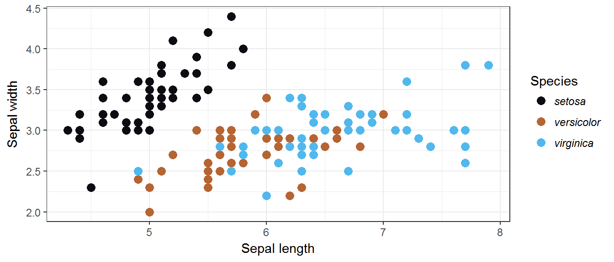
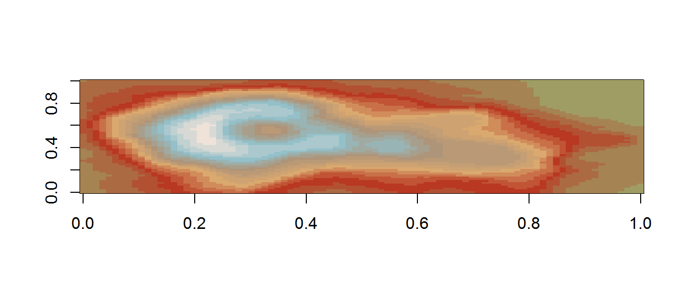
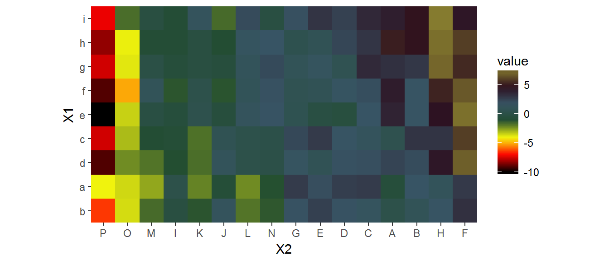
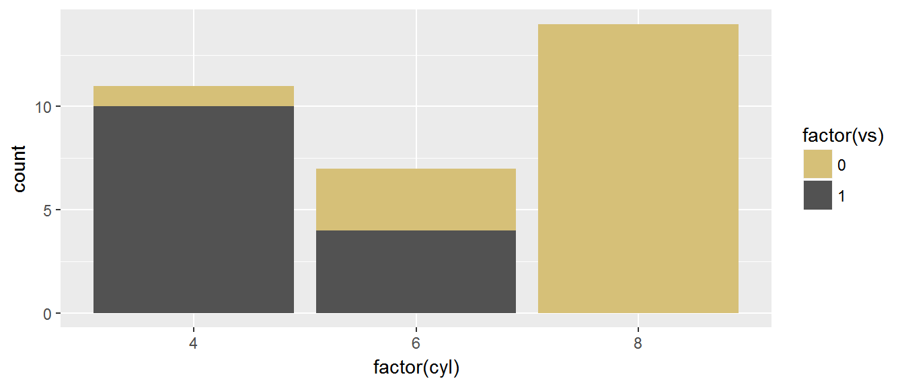

<!-- Please edit README.Rmd and use to generate README.md -->

---
title: "sfPalettes - Sci-fi movie colour palettes"
---


Not too long ago, on a laptop not that far away...

sfPalettes is a library of colour palettes based on popular (and, perhaps, not so popular) science fiction movies. All colour palettes in this package were created using a number of publically available sources, including screenshots and posters. 

sfPalettes was inspired by Kartik Ram's [wesanderson](https://github.com/karthik/wesanderson) package and Chris Hamm's [spaceMovie](https://github.com/butterflyology/spaceMovie) Star Wars-themed package.. 

### Installation

```r
devtools::install_github("arcaravaggi/sfPalettes")
```

### Usage

```r
library(sfPalettes)
# See all palettes
names(SF_palettes)
```

```
##  [1] "Hope"     "Rogue"    "Empire"   "Jedi"     "Menace"   "Clones"  
##  [7] "Sith"     "Force"    "Jurassic" "Her"      "Martian"  "Sunshine"
## [13] "Future"
```

### Package palettes and example plots

#### A New Hope

```r
library("ggplot2")
ggplot(iris, aes(Sepal.Length, Sepal.Width, color = Species)) +
  theme_bw() +
  geom_point(size = 3) +
  scale_color_manual(values = SF_palette("Hope")) +
  labs(y = "Sepal width", x = "Sepal length") +
  theme(legend.text = element_text(face = "italic"))
```




```r
SF_palette("Hope")
```


#### Attack of the Clones

```r
SF_palette("Clones")
```


#### Back to the Future

```r
SF_palette("Future")
```


#### Eternal Sunshine of the Spotless Mind

```r
SF_palette("Sunshine")
```


#### Her

```r
pal <- SF_palette("Her", 21, type = "continuous")
image(volcano, col = pal)
```




```r
SF_palette("Her")
```


#### Jurassic Park

```r
pal <- SF_palette("Jurassic", 100, type = "continuous")
# heatmap is a local dataset
ggplot(heatmap, aes(x = X2, y = X1, fill = value)) +
  geom_tile() + 
  scale_fill_gradientn(colours = pal) + 
  scale_x_discrete(expand = c(0, 0)) +
  scale_y_discrete(expand = c(0, 0)) + 
  coord_equal() 
```




```r
SF_palette("Jurassic")
```


#### Rogue One

```r
SF_palette("Rogue")
```


#### Return of the Jedi

```r
SF_palette("Jedi")
```


#### Revenge of the Sith

```r
SF_palette("Sith")
```


```r
qplot(factor(cyl), data=mtcars, geom="bar", fill=factor(vs)) + 
  scale_fill_manual(values = SF_palette("Sith"))
```



#### The Empire Strikes Back

```r
SF_palette("Empire")
```


#### The Force Awakens

```r
SF_palette("Force")
```


#### The Martian

```r
SF_palette("Martian")
```


#### The Phantom Menace

```r
SF_palette("Menace")
```


## Development

### Contributions

Contributors are welcome to fork the package and suggest additions or improvements.  

### I found a bug

Please report it to the [issue tracker][issues]. Please provide specific details, allowing the error to be reproduced and investigated. Always note the version of R you are using, along with any other relevant software (e.g. RStudio).  

[issues]: https://github.com/arcaravaggi/sfPalettes/issues

## License

This package is free software; you can redistribute it and/or modify it under the terms of the GNU General Public License, version 3, as published by the Free Software Foundation.

This program is distributed in the hope that it will be useful, but without any warranty; without even the implied warranty of merchantability or fitness for a particular purpose. See the GNU General Public License for more details.

A copy of the GNU General Public License, version 3, is available at https://www.r-project.org/Licenses/GPL-
